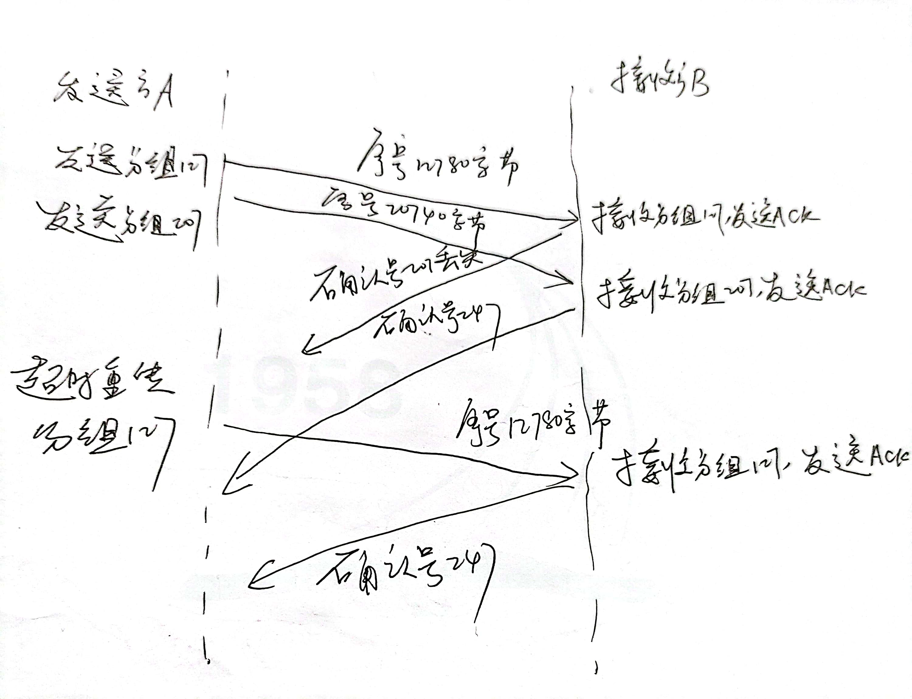

# HW3
## PB21111686_赵卓
### T15
- $L/R = 15 * 8000 / 10^9= 0.012$，因此大约需要
$U = X(L/R) / (RTT + L/R) = 0.9
X = 2251$。

### T22
- a.k-4, k-3, k-2, k-1, k, k+1, k+2, k+3
   - k-4, k-3, k-2, k-1的极端情况：此时发送端发送了k-4, k-3, k-2, k-1的报文，接收方收到，但是ACK
  报文接收方还没有收到k, k+1, k+2, k+3的极端情况：发送方发送了k, k+1, k+2, k+3报文，接收方还没有收到。
- b.k-5, k-4, k-3, k-2, k-1
   - k-4, k-3, k-2, k-1, k的极端情况：发送方发送k-5，接收方收到并且返回ACK(k-5)。发送方收到之前就
  超时，重发k-5。发送方收到ACK(k-5)， 发送k-4, k-3, k-2, k-1。接收方收到重发k-5，返回ACK(k-5)。收到
  k-4, k-3, k-2, k-1，返回ACK(k-4)，ACK(k-3)，ACK(k-2)，ACK(k-1)。
### T23
- 如果报文在信道中不会重新排序：
   - 对于GBN协议，发送方窗口最大为k-1。
如果窗口为k，就会出现书中图3-27的情况，如果窗口的所有报文的ACK丢失，都被重传，接收方会认为是新报文。
   - 对于SR协议，发送方窗口最大为k/2。
如果大于k-2。就会出现书中图3-27的情况，如果窗口的所有报文的ACK丢失，都被重传。接收方会认为是新报文。

### T25
- a. UDP不会对报文进行分片，而TCP会进行分片。
- b. UDP没有拥塞控制和流量控制，可以自己调整发送速度。

### T27
- a. 序号207，源端口号302，目的端口号80。
- b. 确认号207，源端口号80，目的端口号302。
- c. 确认号247。
- 如图所示
  
### T37
- a.
   - GBN协议：
     - A总共发送了9个报文段。最初发送报文段1、2、3、4、5，然后重新发送报文段2、3、4和5。
     - B发送了8个ACK。4个序列号为1的ACK，4个序列号为2、3、4的ACK。
    - SR协议：
      - A总共发送了6个报文段。最初发送到片段1、2、3、4、5，然后再发送到片段2。
      - B发送了5个ACK。4个序列号为1、3、4、5ACK，一个序列号为2的ACK。
    - TCP协议：
        - 总共发送了6个报文段。最初发送到片段1、2、3、4、5，然后再发送到片段2。
      - B发送了5个ACK。4个序列号为2的ACK，一个序列号为6的ACK。
- b. TCP协议时间最短，因为TCP使用快速重传，不需要等待时间超时。

### T40
- a. 慢启动的时间为：1-6，23-26。
- b. 拥塞避免的时间为：6-16，17-22。
- c. 根据3个冗余ACK检测出来的。
- d. 根据超时检测出来的。
- e. 阈值最初为32，因为在这个窗口大小下，慢启动停止和堵塞避免开始
- f. 当检测到丢包时，该阈值被设置为拥塞窗口值的一半。当在第16轮检测到损失时，拥塞窗口大小为42。因此，在
  第18轮传输过程中，阈值是21。
- g. 当检测到丢包时，该阈值被设置为拥塞窗口值的一半。当在第22轮传输期间检测到损失时，拥塞窗口大小为29。
  因此，在第24轮传输过程中，阈值为14（取低层14.5）。
- h. 第1轮发送，发送包1，第2轮发送包2-3，第3轮发送包4-7，第4轮发送包8-15，第5轮发送包16-31，第6轮发送包
  62-63，第7轮发送包64-96。因此，数据包70在第7轮传输中被发送。
- i. 窗口长度为1，ssthresh为4。
- j. 窗口长度为4，ssthresh为21。
- k. 第17轮发送1个分组；第18轮发送2个分组；第19轮发送4个分组；第20轮发送8个分组；第21轮发送16个分组；
  第22轮发送21个分组。因此总共发送52个分组。

### T44
- a. 需要1个RTT增加到7个MSS；2个RTT增加到8个MSS；3个RTT增加到9个MSS；4个RTT增加到10个MSS；5个RTT增加
  到11个MSS；6个RTT增加到12个MSS。
- b. 第一个RTT发送了6个MSS；第二个RTT发送了7个MSS；第三个RTT发送了8个MSS；在第四个RTT，发送了9个MSS；
  在第五个RTT，发送了10个MSS；在第六个RTT，发送了11个MSS。因此，直到时间6 RTT，$6+7+8+9+10+11=51MSS$
  被发送。因此，在6 RTT之前的平均吞吐量是$\frac{51 MSS}{6 RTT}= 8.5MSS/RTT$

### T45
- a.一个周期内发送数据包数量为$\frac{W}{2}+(\frac{W}{2}+1)+...+W=\sum_{n=0}^{\frac{W}{2}}(\frac{W}
  {2}+n)=\frac{3}{8}W^2+\frac{3}{4}W$，因此丢包率为$L=\frac{1}{\frac{3}{8}W^2+\frac{3}{4}W}$。
- b.由于$\frac{3}{8}W^2\gg\frac{3}{4}W$，因此$L\approx\frac{3}{8}W^2$，即$W\approx\sqrt{\frac{8}
  {3L}}$，因此平均速率=$\frac{3}{4}\sqrt{\frac{8}{3L}}\cdot\frac{MSS}{RTT}=\frac{1.22\cdot MSS}{RTT\sqrt{L}}$

### T46
- a.1个RTT发送的字节数为$10M * 150ms = 1.5MB$，窗口长度最大为$1.5Mb / (1500 * 8) = 125$。
b.平均窗口为长度最大为$0.75 * 125 = 93$。
平均吞吐量 $93 * 1500 * 8/150ms = 7.44Mbps$。
c.不考虑慢启动状态，即直接从W/2开始拥塞避免状态，窗口从62到125，经历63个RTT，9.45s。

